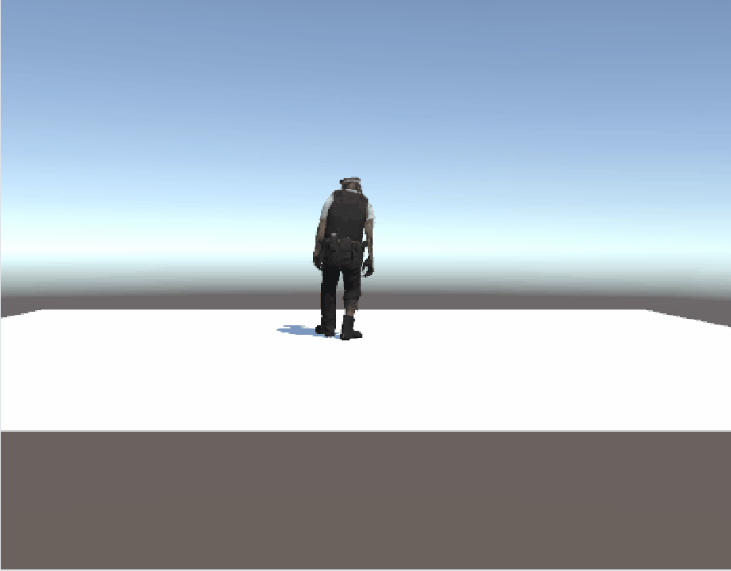
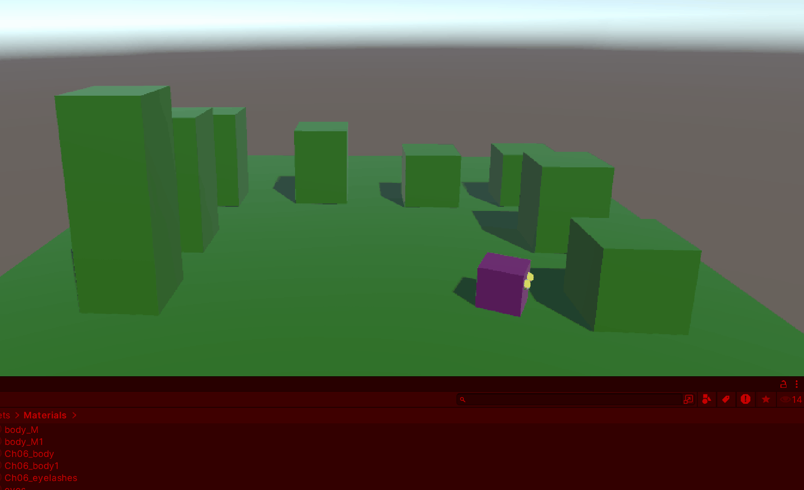
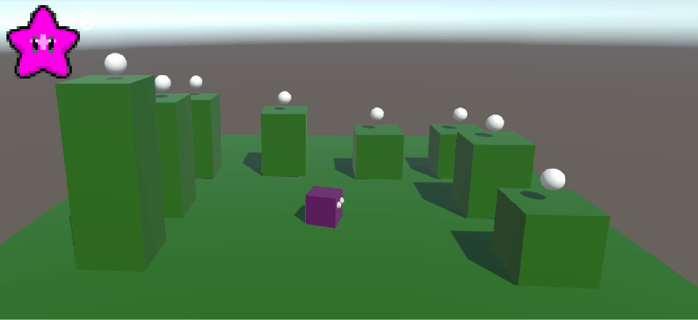

# Turorial 1

### Ik heb een character gemaakt die als idle een dansje doet en als ik op de ArrowUp knop klik doet het character een ander dansje waarbij als die klaar is hij weer terug gaat naar de idle dans.

[link naar code](Tutorial_1/Assets/scripts/Animatie.cs)

# Tutorial 2

### Ik heb een character gemaakt die een kan bewegen en draaien met movement keys en daarbij een animatie afspeelt.

[Link naar code animatie](Tutorial_1/Assets/scripts/animatie2.cs)
[Link naar code movement](Tutorial_1/Assets/scripts/MoveBasic.cs)

# Tutorial 3

### Ik heb een bewegende speler gemaakt di kan springen en over een vloer en platformen. Ook heb ik tags en materials gemaakt en deze op de speler en wereld geplaatst.

[Link naar code bewegen](Tutorial_1/Assets/scripts/MoveBasic.cs)
[Link naar code Jump](Tutorial_1/Assets/scripts/jump.cs)

#Tutorial 4

### Ik heb een object toegevoegd die de speler kan oppakken en heirbij en kleine animatie afspeelt, geluid maakt en punten geeft voor het score systeem dat ik ook heb toegevoegd.

[Link naar code pick up item](Tutorial_1/Assets/scripts/GetPickUp.cs)
[Link naar code voor score](Tutorial_1/Assets/scripts/KeepScore.cs)